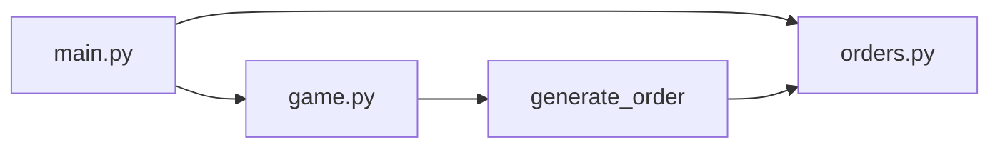
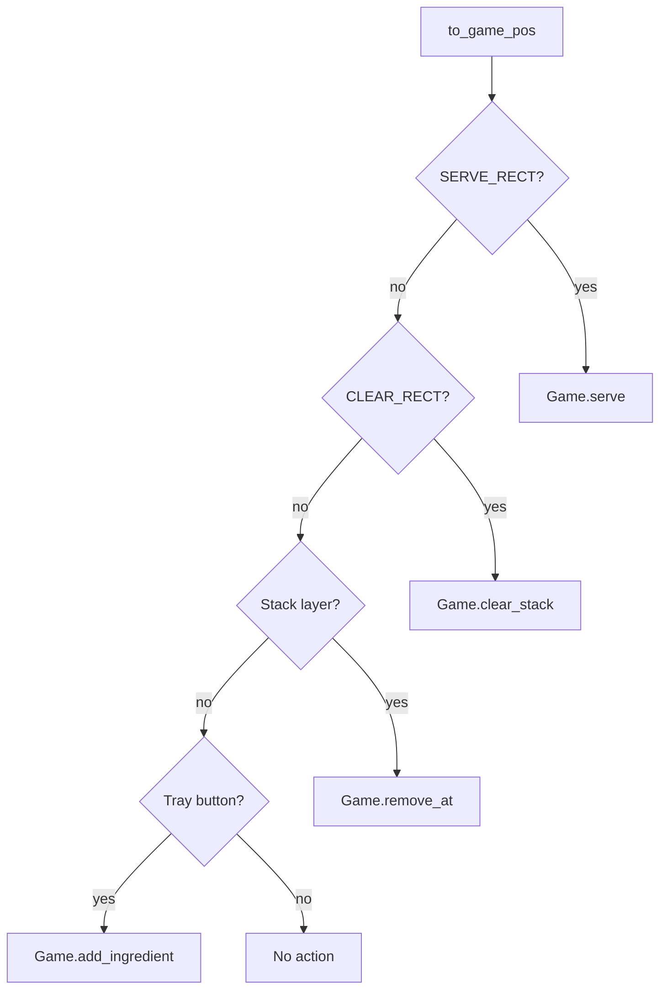
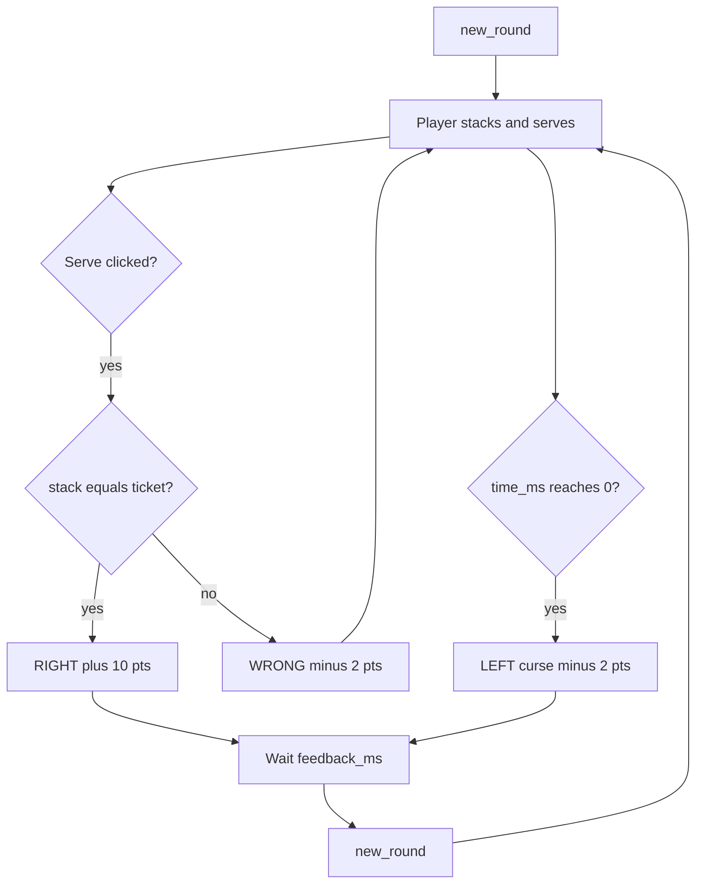

# Burger Stop architecture

This document explains how the Burger Stop code is organized, how a frame of the game runs, and what each type and function is for.

## Table of contents

1. [Overview](#1-overview)
2. [Module map](#2-module-map)
3. [Program flow](#3-program-flow)
   - [Main loop](#31-main-loop)
   - [Click routing](#32-click-routing)
   - [Round, serve, and timer](#33-round-serve-and-timer)
4. [Methods](#4-methods)
   - [`orders.py`](#41-orderspy)
   - [`game.py`](#42-gamepy)
   - [`main.py`](#43-mainpy)
5. [Appendix](#5-appendix)
   - [A. Scoring and timing constants](#a-scoring-and-timing-constants)
   - [B. Display scale and layout](#b-display-scale-and-layout)
   - [C. Palette, ingredients, and tray order](#c-palette-ingredients-and-tray-order)
   - [D. Assets and project files](#d-assets-and-project-files)
   - [E. Feedback states](#e-feedback-states)

## 1. Overview

Burger Stop is a small 8-bit pygame-ce game. The player reads a customer ticket, stacks ingredients on a plate, and serves. A correct stack scores points; a wrong stack or a timed-out customer costs points.

Logic lives in three Python modules:

- [`main.py`](../main.py) creates the window, maps clicks, and draws the 320×240 pixel scene (then scales it up).
- [`game.py`](../game.py) owns the current order, the player's stack, score, timer, and serve/timeout outcomes.
- [`orders.py`](../orders.py) defines ingredient colors, tray order, and random tickets.

The loop never talks to pygame from `game.py`. `Game` is plain data and rules; `main.py` is the only I/O layer.

## 2. Module map



`main.py` imports `Game`, `Feedback`, and `ORDER_MS` from `game.py`, and `INGREDIENTS`, `PALETTE`, and `TRAY_ORDER` from `orders.py`. `Game.new_round` calls `generate_order()`.

## 3. Program flow

### 3.1 Main loop

Startup builds a native 320×240 surface plus a 960×720 window (3× nearest-neighbor scale). Each frame: handle input, advance game time, draw, blit.

```mermaid
flowchart TD
  start[pygame.init and Game]
  events[Pump pygame events]
  click{Left click?}
  handle[handle_click]
  update[Game.update dt]
  draw[draw_scene]
  scale[scale_by 3x]
  flip[display.flip]
  quitEvent{Quit or Escape?}
  stop[pygame.quit]
  start --> events
  events --> quitEvent
  quitEvent -->|yes| stop
  quitEvent -->|no| click
  click -->|yes| handle
  click -->|no| update
  handle --> update
  update --> draw
  draw --> scale
  scale --> flip
  flip --> events
```

### 3.2 Click routing

Window coordinates are divided by `SCALE` before hit-testing. Checks run in this order so Serve/Clear win over the burger, and a burger layer wins over the tray.



While `Game.busy()` is true (wrong flash, success flash, or walk-off), add/remove/clear/serve return immediately.

### 3.3 Round, serve, and timer

A round starts with a random ticket and a 30-second clock. The clock still ticks during a wrong-serve flash. It pauses during a successful serve or an angry walk-off, then a new round starts.



Anger is derived from elapsed time (or forced to max when the customer has left):

- 0–10s elapsed: calm (`anger` 0)
- 10–20s: annoyed (`anger` 1)
- 20–30s: irate (`anger` 2)
- walk-off: rage (`anger` 3)

## 4. Methods

Signatures match the source. Purpose is the intended job of each symbol, not a line-by-line rewrite.

### 4.1 `orders.py`

#### `class Order`

```python
@dataclass(frozen=True)
class Order:
    customer: str
    items: tuple[str, ...]
```

Immutable ticket: customer name plus ingredient ids from plate up (`bottom_bun` first, `top_bun` last).

#### `generate_order() -> Order`

Builds a random order: 2–4 fillings between the buns, and a name from `CUSTOMERS`.

### 4.2 `game.py`

#### `class Feedback`

Enum of round presentation states: `NONE` (playing), `WRONG` (red flash), `RIGHT` (green flash), `LEFT` (timer expired).

#### `Game.__init__() -> None`

Zeroes score and starts the first round via `new_round()`.

#### `Game.new_round() -> None`

Replaces the ticket and customer, empties the stack, resets feedback, curse text, and the 30-second timer.

#### `Game.busy() -> bool`

True when feedback is not `NONE`. Used to lock building during flashes and walk-off.

#### `Game.seconds_left` (property) `-> int`

Ceiling of remaining milliseconds, for the HUD (`T30` … `T00`).

#### `Game.anger` (property) `-> int`

0–3 mood used by the face, ticket tint, and timer color.

#### `Game.add_ingredient(ingredient_id: str) -> None`

Appends an ingredient to the stack unless the game is busy.

#### `Game.remove_at(index: int) -> None`

Removes one stack index unless busy or the index is out of range.

#### `Game.clear_stack() -> None`

Clears the whole stack unless busy.

#### `Game.serve() -> None`

Compares stack to ticket. Match: +10 and `RIGHT`. Mismatch: score floored at 0 after −2, and `WRONG`.

#### `Game._time_out() -> None`

Internal: −2 (floored at 0), `LEFT`, pick a curse from `CURSES`.

#### `Game.update(dt_ms: int) -> None`

Advances the order clock and/or the flash timer. Hits `_time_out` at 0 ms. After `RIGHT` or `LEFT` flash ends, calls `new_round`. After `WRONG` flash ends, clears the stack and returns to `NONE`.

### 4.3 `main.py`

#### `load_font(size: int) -> pygame.font.Font`

Loads Press Start 2P when the TTF is present; otherwise pygame's default font.

#### `draw_text(surf, font, text, pos, color) -> pygame.Rect`

Renders uppercase pixel text without anti-aliasing and blits it.

#### `draw_panel(surf, rect, fill) -> None`

Filled ticket-style box with a black frame and dotted inner edges.

#### `shade(color, delta) -> tuple[int, int, int]`

Clamped RGB offset for button and bun highlights.

#### `draw_button(surf, rect, fill, label, font, label_color=...) -> None`

Beveled 8-bit button with a centered label.

#### `draw_customer(surf, x, y, anger) -> None`

16×18-ish pixel face. Mouth, brows, and skin change with `anger`.

#### `stack_highlight(game) -> tuple[int, int, int] | None`

Red tint for `WRONG`, green for `RIGHT`, else none.

#### `draw_burger_layer(surf, ingredient_id, cx, top, width) -> int`

Draws one ingredient rectangle (special shapes for buns) and returns its height.

#### `stack_layer_rects(items, area) -> list[tuple[int, pygame.Rect]]`

Hitboxes for each stack layer, matching how the burger is drawn (plate up).

#### `layer_width(ingredient_id: str) -> int`

Pixel width for a layer (buns widest, cheese slightly wide, fillings 64).

#### `draw_stack(surf, items, area, outline) -> None`

Draws the burger from the plate upward. Optional color flash around the stack.

#### `make_tray_buttons() -> dict[str, pygame.Rect]`

Tray button rects in `TRAY_ORDER` (top bun at the top of the column).

#### `draw_scene(surf, game, font, tiny, tray_buttons) -> None`

Full frame: HUD, ticket, build plate, tray, message, Serve/Clear.

#### `to_game_pos(pos) -> tuple[int, int]`

Converts window pixels to 320×240 game pixels.

#### `handle_click(game, pos, tray_buttons) -> None`

Routes a left click as in [§3.2](#32-click-routing).

#### `main() -> None`

Entry point: window, loop, shutdown.

## 5. Appendix

### A. Scoring and timing constants

Defined in [`game.py`](../game.py):

| Name | Value | Role |
| --- | --- | --- |
| `CORRECT_POINTS` | 10 | Awarded on a matching serve |
| `WRONG_PENALTY` | 2 | Subtracted on a wrong serve or timeout (score never below 0) |
| `WRONG_MS` | 900 | Red flash duration |
| `RIGHT_MS` | 1200 | Green flash duration |
| `LEFT_MS` | 1800 | Walk-off / curse duration |
| `ORDER_MS` | 30_000 | Time allowed per customer |
| `CURSES` | five short strings | Random line shown on timeout |

### B. Display scale and layout

Native surface is **320×240**. Window is **960×720** (`SCALE = 3`). `SDL_HINT_RENDER_SCALE_QUALITY` is set to `"0"` so scaling stays nearest-neighbor.

Layout rects in native pixels ([`main.py`](../main.py)):

| Name | Rect | Role |
| --- | --- | --- |
| `HUD_RECT` | `(0, 0, 320, 18)` | Title, timer, score |
| `TICKET_RECT` | `(6, 22, 86, 176)` | Customer and order list |
| `BUILD_RECT` | `(98, 22, 114, 176)` | Plate and burger |
| `TRAY_RECT` | `(218, 22, 96, 176)` | Ingredient buttons |
| `MSG_RECT` | `(6, 202, 206, 32)` | Status / curse line |
| `SERVE_RECT` | `(218, 204, 46, 28)` | Serve |
| `CLEAR_RECT` | `(268, 204, 46, 28)` | Clear |

The ticket lists ingredients **top bun first** (visual burger). The player's stack is stored **bottom bun first** (build order). Drawing walks the stack from the plate upward so the top bun sits on top.

### C. Palette, ingredients, and tray order

[`orders.py`](../orders.py) `PALETTE` is a small NES-like RGB set (`navy`, `cream`, `red`, `green`, skin tones, and so on).

`INGREDIENTS` maps id → `{label, color, height}` for: `bottom_bun`, `patty`, `cheese`, `lettuce`, `tomato`, `onion`, `pickle`, `top_bun`.

`TRAY_ORDER` (top of the tray column to bottom):

`top_bun`, `pickle`, `onion`, `tomato`, `lettuce`, `cheese`, `patty`, `bottom_bun`.

`FILLINGS` is the random middle of each ticket. `CUSTOMERS` is the name pool.

### D. Assets and project files

| Path | Role |
| --- | --- |
| [`main.py`](../main.py) | Loop, input, drawing |
| [`game.py`](../game.py) | Round rules |
| [`orders.py`](../orders.py) | Catalog and tickets |
| [`requirements.txt`](../requirements.txt) | `pygame-ce>=2.5.3` |
| [`assets/PressStart2P-Regular.ttf`](../assets/PressStart2P-Regular.ttf) | Pixel HUD font |
| [`assets/OFL.txt`](../assets/OFL.txt) | Font license |
| [`README.md`](../README.md) | Setup (including Windows) and how to play |
| [`.gitignore`](../.gitignore) | Ignores `.venv`, bytecode, `.DS_Store` |

### E. Feedback states

| State | HUD / message | Burger | Clock |
| --- | --- | --- | --- |
| `NONE` | `STACK THE ORDER` | Normal | Ticking |
| `WRONG` | `TRY AGAIN` | Red highlight | Still ticking |
| `RIGHT` | `ORDER COMPLETE!` | Green highlight | Paused |
| `LEFT` | Random curse | No success/fail tint | Stopped at 0 |
